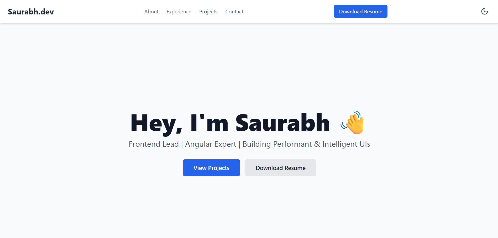

# Saurabh's Personal Portfolio Website

This repository contains the source code for my personal portfolio, designed to showcase my skills, professional experience, and projects as a Frontend Lead specializing in the Angular ecosystem. The site is built from the ground up with modern web technologies, focusing on performance, clean code, and a dynamic user experience.

<br>



---

## ✨ Features

-   **Modern & Responsive Design**: Fully responsive layout built with Tailwind CSS, ensuring a great experience on all devices, from mobile phones to desktops.
-   **Angular Standalone Architecture**: Built using Angular's modern standalone components, directives, and pipes for a clean, modular, and `NgModule`-free structure.
-   **🌓 Dark/Light Mode Toggle**: A user-friendly theme switcher that respects user preference (`prefers-color-scheme`) and saves the chosen theme in `localStorage`.
-   **🚀 On-Scroll Animations**: Subtle and professional animations powered by the AOS (Animate on Scroll) library to engage visitors as they scroll.
-   **💼 Interactive Experience Timeline**: A collapsible timeline in the experience section that allows users to focus on one role at a time, creating a cleaner interface.
-   **Clean Code & Best Practices**: Adheres to Angular best practices, including a dedicated service for theme management and strong typing with TypeScript.

---

## 🛠️ Tech Stack

-   **Framework**: [Angular](https://angular.io/) (v17+)
-   **Language**: [TypeScript](https://www.typescriptlang.org/)
-   **Styling**: [Tailwind CSS](https://tailwindcss.com/)
-   **Animations**: [AOS (Animate on Scroll)](https://michalsnik.github.io/aos/) & Angular Animations
-   **Deployment**: GitHub Pages / Netlify

---

## 🚀 Getting Started

Follow these instructions to get a copy of the project up and running on your local machine for development and testing purposes.

### Prerequisites

Make sure you have the following installed on your system:
-   [Node.js](https://nodejs.org/) (v18 or higher)
-   [Angular CLI](https://angular.io/cli) (v17 or higher)

### Installation

1.  **Clone the repository**
    ```sh
    git clone [https://github.com/](https://github.com/)imbusyaf/portfolio.git
    ```

2.  **Navigate to the project directory**
    ```sh
    cd portfolio
    ```

3.  **Install NPM packages**
    ```sh
    npm install
    ```

---

## ‍💻 Available Scripts

In the project directory, you can run the following commands:

-   **`ng serve`**
    Runs the app in development mode. Open [http://localhost:4200](http://localhost:4200) to view it in the browser. The app will automatically reload if you change any of the source files.

-   **`ng build`**
    Builds the app for production to the `dist/` folder. It correctly bundles Angular in production mode and optimizes the build for the best performance.

-   **`ng test`**
    Launches the test runner in interactive watch mode.

-   **`ng lint`**
    Runs the linter to analyze the code for potential errors and style inconsistencies.

---

## 📄 License

This project is licensed under the MIT License. See the `LICENSE` file for details.

---

## 📫 Contact

Saurabh - [sagrawal.sa66@gmail.com](mailto:sagrawal.sa66@gmail.com)

LinkedIn: [https://www.linkedin.com/in/saurabh-agrawal-dev/](https://www.linkedin.com/in/saurabh-agrawal-dev/)

Project Link: [https://github.com/imbusyaf](https://github.com/imbusyaf)